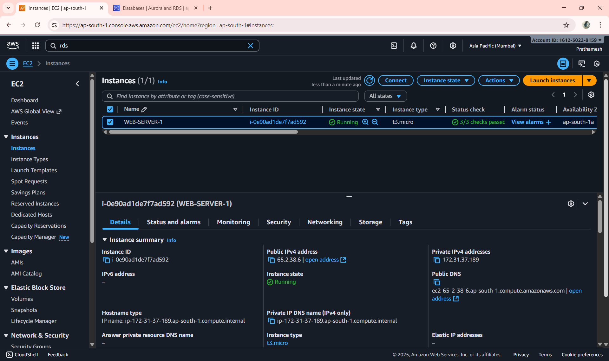
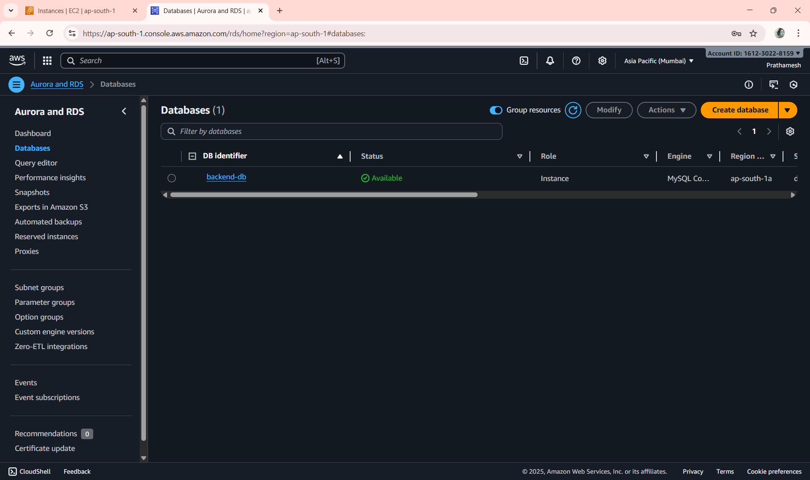
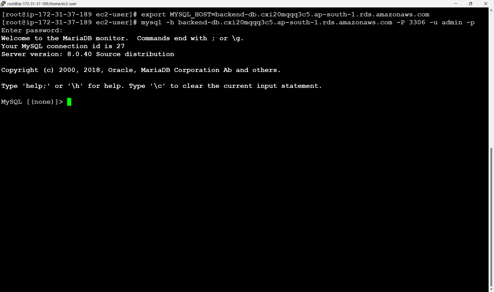
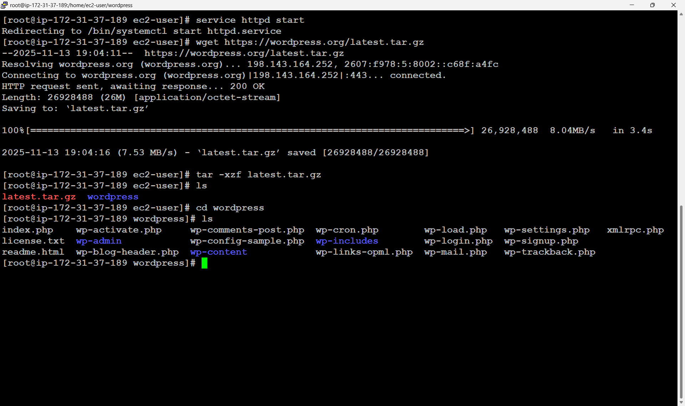
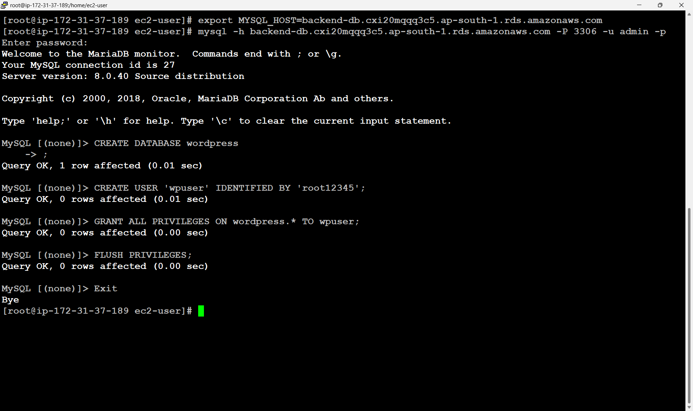
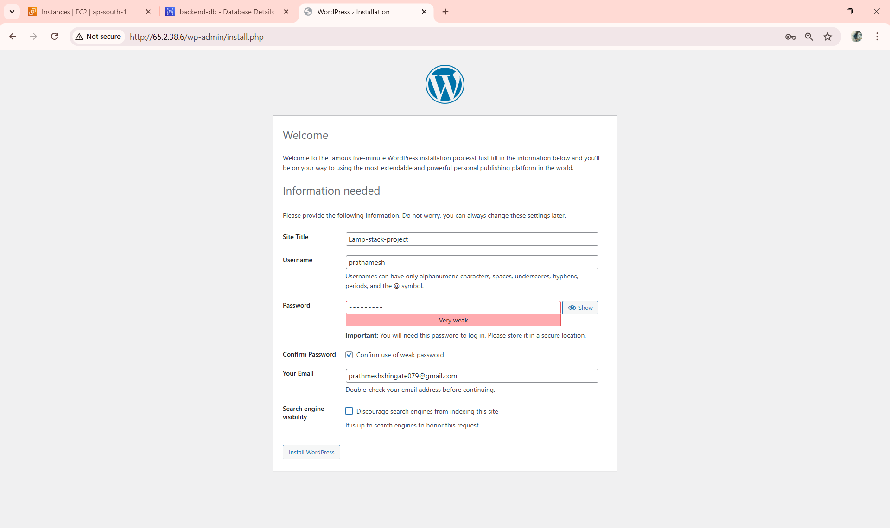
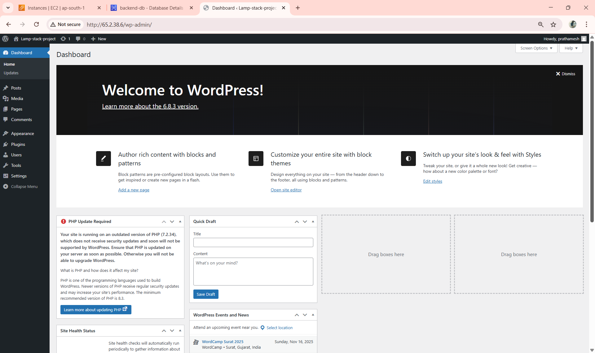
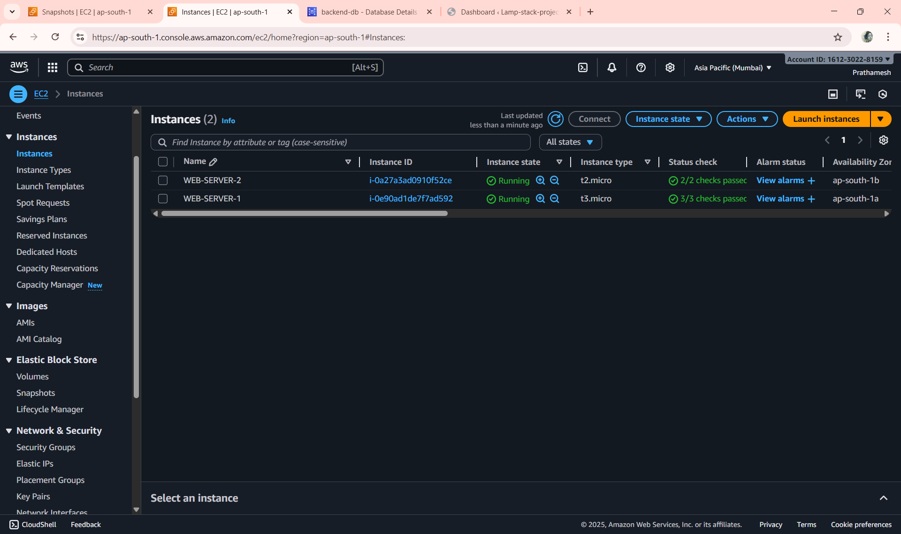
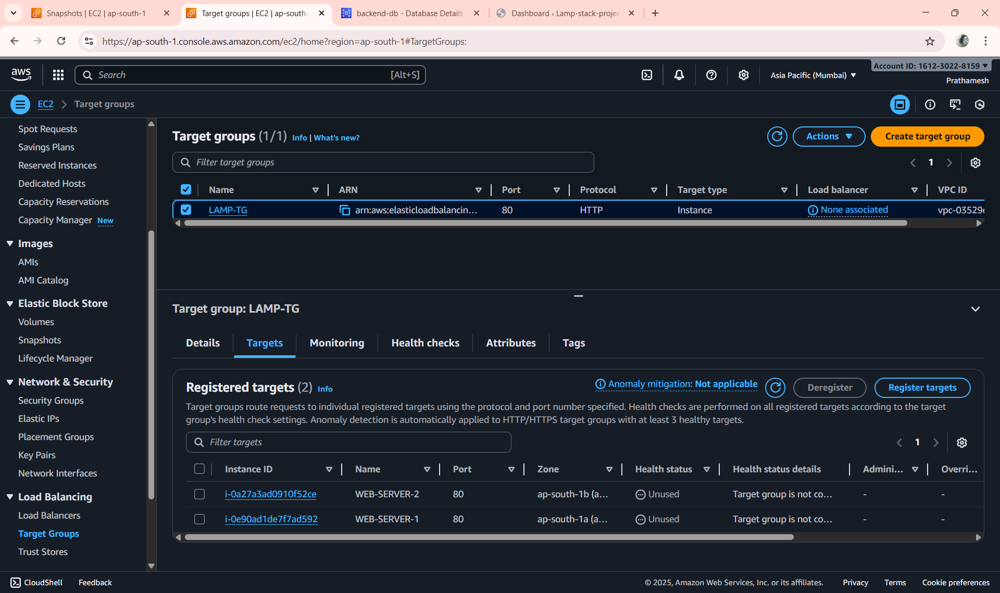
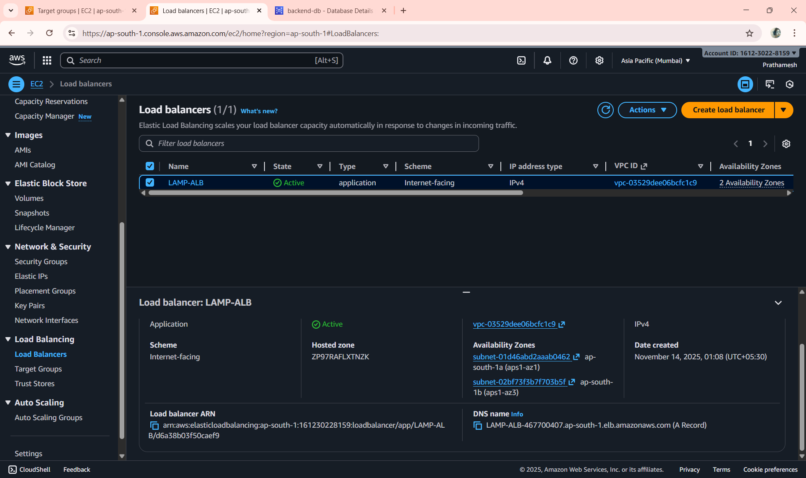

# 3tier-wordpress-deployment
3-Tier Web Application Deployment on AWS using the LAMP Stack (Linux, Apache, MySQL, PHP)

## 📝 Project Overview

This project deploys a WordPress website on AWS using a three-tier architecture. The WordPress application runs on an EC2 instance configured with the LAMP stack (Linux, Apache, MySQL client, and PHP), while the database is hosted on an Amazon RDS MySQL instance for improved security and easier management. An Application Load Balancer (ALB) is used to route incoming traffic to the EC2 instance, providing a single access point and better availability. WordPress is configured to connect to the RDS database using the RDS endpoint, and the site can be accessed through the ALB DNS once the setup is completed.

## ⭐ Key Features

- Deploys WordPress on an EC2 instance using the LAMP stack (Linux, Apache, MySQL client, PHP)
- Uses Amazon RDS MySQL for secure and managed database hosting
- Integrates an Application Load Balancer (ALB) for improved traffic distribution and availability
- Separates application and database layers following a 3-tier architecture
- Configures WordPress to connect directly with the RDS database endpoint
- Ensures easier scaling and better performance compared to single-server setups
- Provides a clean and repeatable setup process for cloud-based WordPress hosting
---
1. Launch a Amazon Linux 2 image EC2 instance 

2. Create a RDS MySQL Engine (private)
   Allow protocols in SG , MySQL or anywhere


3. Login to the EC2 instance and install MySQL client
  
```bash
 yum install -y MySQL
```
Export MySQL endpoint as MySQL_HOST Variable
```bash
export MYSQL_HOST=backend-db.cxi20mqqq3c5.ap-south-1.rds.amazonaws.com
```


4. Connect to RDS and create Database

Connect to RDS MySQL to create required database and users
```bash
mysql -h backend-db.cxi20mqqq3c5.ap-south-1.rds.amazonaws.com -P 3306 -u admin -p
```
create a database
```bash
CREATE DATABASE wordpress;
CREATE USER 'wpuser' IDENTIFIED BY 'root12345';
GRANT ALL PRIVILEGES ON wordpress.* TO wpuser;
FLUSH PRIVILEGES;
Exit
```

5. Now install and configure apache server to deploy the wordpress application

```bash
yum install -y httpd
service httpd start
```

Download a wordpress template and unzip the wordpress

```bash
wget https://wordpress.org/latest.tar.gz

tar -xzf latest.tar.gz

ls

cd wordpress
```


Create a wp-config file from sample file already provided.
```bash
touch wp-config.php

cp wp-config-sample.php wp-config.php

cat wp-config.php
```

6. Edit the wp-config.php file to point to backend-db database.
```bash
vi wp-config.php
```

Replace the Database_name_here , "username_here" , "password_here" and "rds-endpoint-name" with valid information

/* The name of the database for wordpress */
```bash
define( 'DB_NAME' , 'wordpress' );

/** MySQL database username **/
define ( 'DB_USER' , 'wpuser' );

/** MySQL database password */
define( 'DB_PASSWORD' , 'root12345' );

/* MySQL hostname */
define( 'DB_HOST' , 'backend-db.cxi20mqqq3c5.ap-south-1.rds.amazonaws.com');
```


7. Now go to below link and it provides some information to update the wp-config file .
    It looks like below shared one .
```bash
https://api.wordpress.org/secret-key/1.1/salt/ --> open this in browser , it will generate few tokens and replace in this file.
```
8. Now install dependencies for the Amazon-linux-2 machine.

```bash
sudo amazon-linux-extras install -y lamp-mariadb10.2-php7.2 php7.2
```

9. Come back to home directory and copy all context to /var/www/html , then restart the service.

```bash
cd /home/ec2-user

cp -r wordpress/* /var/www/html/

service httpd restart
```

10. place the EC2 public ip to the browser : it ask for username and password and install wordpress.





11. For High Availability and Zero downtime 

Create image from the current EC2 and launch one more EC2 from it.



create a target Group and add the both EC2 instances in the target group for ALB and attach that target group to Application load banlancer.



12. Create a ALB 


After that give the DNS url to User to Access the application!!

```bash
LAMP-ALB-467700407.ap-south-1.elb.amazonaws.com
```

## 🎉 Final Result

A complete WordPress site is now hosted on AWS using ALB, EC2, and RDS, fully configured and ready to use.
